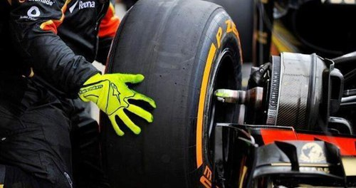
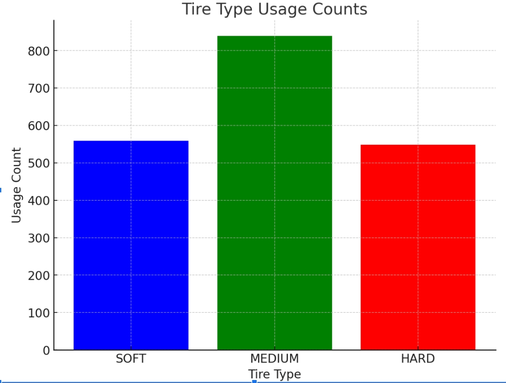
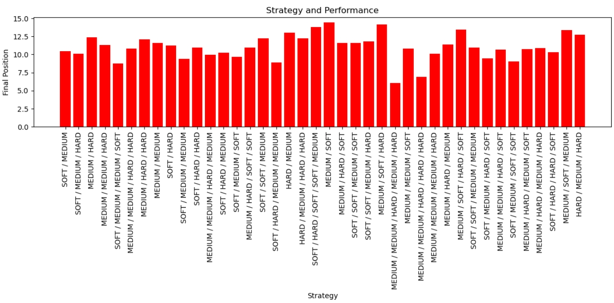

# Tire Strategy

---

## Introduction

In Formula 1 racing, tire strategy is critical for success. We are refining a  model to assess its impact on race results. The model analyzes factors like compound choice and stint lengths, using historical data and algorithms to link tire strategy with performance. Our goal is to equip strategists with insights for data-informed decisions that can lead to victory.

## Datasets Used
- [FastF1](https://github.com/theOehrly/Fast-F1)
  
## Data Collection

Data from the 2017-2022 F1 Grand Prixes were pulled from the FastF1 API.

## Output

## Analysis

- TIRE USAGE TRENDS: The drivers most frequently used medium tires, with the usage of soft and hard tires being roughly similar.
- MORE CHANGES, HIGHER RANK: Although changing tires takes a few seconds, the results show that strategies involving more tire changes often lead to higher rankings.
- HARD TIRE BETTER: Although people generally believe that soft tires perform better, the most effective strategies consist only of medium and hard tires, while the worst strategies include soft tires
- INSIGHTS AND LIMITATIONS: Final position for various strategies range from 5th to 15th place, suggesting the model's inability to predict driver rankings precisely. However, it provides directional insights for rough predictions based solely on tire strategy.
 
