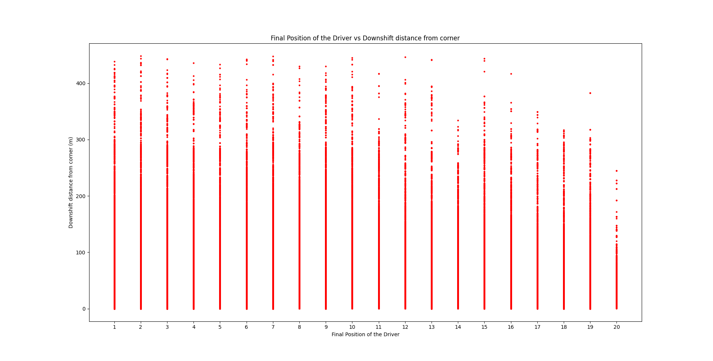

# F1 Driver Performance vs. Downshift Distance from Corners

---


## Introduction

This analysis aimed to investigate if the distance at which the driver downshifts from corners plays a significant role in their final position at the end of the race.

**TLDR:**

- **Run the Code:** Click [here.](#running-the-code)
- **View visualizations:** Click [here.](#visualizations)
- **View Inference:** Click [here.](#analysis)

## Datasets Used

- [FastF1](https://github.com/theOehrly/Fast-F1)
- [Ergast](https://ergast.com/mrd/)

## Method

Downshift locations were found using gear information at each segment of the track. Each downshift location was mapped to the closest corner after calculating the Euclidean distance. The closest distance was saved and plotted along with the driver's final position.

## Data Collection

Data from the 2018-2022 F1 Grand Prixes were pulled from the FastF1 API.

## Analysis

Data shows that higher ranked drivers are more likely to downshift further from the corners in certain cases than lesser ranked drivers, suggesting a significant correlation between downshift distance from the corners and the driver's final position.

## Possible Explanations

1. **Adaptability:**

   - Better ranked drivers downshift at more variable distances compared to lower ranked drivers, showing their ability to adapt their gear changes to take a sharp or a wide turn based on the nature of the corner.

2. **Transitions:**

   - Better drivers may focus on smooth transitions between gears, as downshifting too close to a corner may cause abrupt engine speed changes, leading to imbalances in the car or the engine.

3. **Exit Speed Optimization:**

   - Skilled drivers may slow down in advance for certain corners in order to maximize acceleration when they exit the turning, so that they can maintain a competitive advantage.

4. **Brake Maintenance**

   - Downshifting earlier allows drivers to brake effectively with less load on the braking mechanism, which may help to prevent the brakes from malfunctioning towards the later stages of the race.

5. **Risk Mitigation**
   - Skilled drivers are confident in their abilities, and thus may concentrate on safety rather than taking risks by downshifting too late, as they are confident that they can make up for it on straight sections of the track.

## Conclusion

Both higher and lower ranked drivers show downshift distances close to the corners. At further distances from the corners, better ranked drivers are more likely to downshift than lesser ranked drivers.

## Running the Code

#### Setup

1. For running this code, Python with versions 3.9 and above is recommended.

2. Clone the repository.

```sh
git clone https://github.com/cssx1234/ECE143-Group15
```

3. Navigate into the cloned folder.

```sh
cd ECE143-Group15
```

4. Install the required dependencies. \
   Example using pip:

```sh
pip install -r requirements.txt
```

#### Visualizing all plots

1. Open `all_visualizations.ipynb` and run using Jupyter Notebook, Google Colab or VS Code.

#### Visualizing each individual plot

1. Open your favorite terminal and navigate to the `individual_plots` directory.

```sh
cd individual_plots
```

2. To visualize the graph for downshift distances vs final position, run:

```sh
python plot_distances_vs_final_position.py
```

3. To visualize the track diagram with the downshifts and corner positions, run:

```sh
python show_corners_and_downshifts.py
```

4. To visualize the track diagram with gear information for each point on the track, run:

```sh
python show_gears_on_track.py
```

#### Note:

The files `calculate_and_save_distances.py`, `show_corners_and_downshifts.py` and `show_gears_on_track.py` require an internet connection to pull data from FastF1 / Ergast's online API.

## Visualizations

#### 1. Downshift Distance from the corner vs Final Position of the Driver



#### 2. Positions of Corners and Downshifts for a single lap (Styrian Grand Prix)

🔵 Locations at which the driver downshifted the gears \
🔴 Locations of corners on the track \
⚫ Corner Number


#### 3. Gear used at each point on the track for a single lap (Styrian Grand Prix)


---

_Author: Sushaanth Srinivasan_
